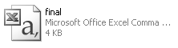

```{r setup, include=FALSE}
source("setup_knitr.R")
```


# Introdução

A entrada de dados no R pode ser realizada de diferentes formas. O
formato mais adequado vai depender do tamanho do conjunto de dados, e se
os dados já existem em outro formato para serem importados ou se serão
digitados diretamente no R.

A seguir são descritas as formas de entrada de dados com
indicação de quando cada uma das formas deve ser usada. Os três
primeiros casos são adequados para entrada de dados diretamente no R, os
seguintes descrevem como importar dados já disponíveis eletronicamentede
um arquivo texto, em outro sistema ou no próprio R.

Posteriormente também será mostrado como fazer para exportar bases de
dados geradas e/ou alteradas dentro do R.

# Entrada de dados

## Entrada de dados diretamente no R

### Vetores

A forma mais básica de entrada de dados no R é através da função `c()`
(como já vimos). A partir dela pode se criar os outros tipos de objetos
como listas e data frames.

As funções básicas de entrada de dados são:

- `c()`
- `rep()`
- `seq()` ou `:`

A partir destas funções básicas podemos criar objetos de classes mais
específicas com

- `matrix()`
- `list()`
- `data.frame()`

### Entrada via teclado

#### Usando a função `scan()`

Esta função lê dados diretamento do console, isto é, coloca o R em modo
*prompt* onde o usuário deve digitar cada dado seguido da tecla
<kbd>Enter</kbd>. Para encerrar a entrada de dados basta digitar
<kbd>Enter</kbd> duas vezes consecutivas.

Veja o seguinte resultado:

```{r, eval=FALSE}
y <- scan()

1: 11
2: 24
3: 35
4: 29
5: 39
6: 47
7:
Read 6 items
```

```{r, echo=2}
y <- c(11, 24, 35, 29, 39, 47)
y
```

Os dados também podem ser digitados em sequência, desde que separados
por um espaço,

```{r, eval=FALSE}
y <- scan()

1: 11 24
3: 35 29
5: 39 47
7:
Read 6 items
```

```{r}
y
```

Este formato é mais ágil que o anterior (com `c()`, por exemplo) e é
conveniente para digitar vetores longos. Esta função pode também ser
usada para ler dados de um arquivo ou conexão, aceitando inclusive
endereços de URLs (endereços da *web*) o que iremos mencionar em
detalhes mais adiante.

Por padrão, a função `scan()` aceita apenas valores numéricos como
entrada (lembre-se que vetores só podem ter elementos da mesma
classe). Para alterar a classe de objeto de entrada, precisamos
especificar o argumento `what` de `scan()`. Por exemplo, para entrar com
um vetor de caracteres, fazemos

```{r, eval=FALSE}
x <- scan(what = "character")

1: a
2: b
3: c
4:
Read 3 items
```

```{r, echo=2}
x <- letters[1:3]
x
```

Outras classe possíveis para o argumento `what` são: `logical`,
`integer`, `numeric`, `complex`, `character`, `raw` e `list`.

### Exercícios 1

1. Usando a função `scan()` crie objetos para armazenar os seguintes
valores:
    a. 19, 13, 19, 23, 18, 20, 25, 14, 20, 18, 22, 18, 23, 14, 19
    b. `joaquina`, `armação`, `praia brava`, `praia mole`, `morro das pedras`
    c. `TRUE`, `TRUE`, `FALSE`, `FALSE`, `TRUE`

#### Usando da função `readLines()`

Esta função é particularmente útil para ler entradas na forma de texto
(*strings*). Por exemplo, para ler uma linha a ser digitada na tela do
R, siga o comando abaixo e digite o texto indicado. Ao terminar pressione
a tecla <kbd>Enter</kbd>  e o texto será armazanado no objeto texto.

```{r, eval=FALSE}
texto <- readLines(n = 1)
```

```{r, eval=FALSE}
Estou digitando no console
```

```{r, echo=2}
texto <- "Estou digitando no console"
texto
```

Um possível uso é dentro que funções que solicitem que o usuário
responda e/ou entre com informações na medida que são
solicitadas. Experimente definir e rodar o função a seguir.

```{r}
fn.ex <- function() {
    cat("Digite o nome do time de futebol de sua preferência (em letras minúsculas)\n")
    time <- readLines(n = 1)
    if (time == "atletico-pr")
        cat("BOA ESCOLHA!!!\n")
    else cat("Ihh, tá mal de escolha...\n")
    return(invisible())
}
```

```{r, eval=FALSE}
fn.ex()
```

Nesse exemplo, `readLines()` foi utilizada para efetuar a leitura via
teclado, mas a função permite ainda entrada de dados por conexões com
outros dispositivos de *input*. Por exemplo, pode ser utilizada para ler
texto de um arquivo. Consulte a documentação da função para maiores
detalhes e exemplos.

<!-- #### Usando `textConnection()` -->

<!-- Esta função generaliza a anterior permitindo que se entre com mais de um -->
<!-- campo por linha, gravando o resultado em um data frame. Por exemplo, -->

<!-- ```{r, eval=FALSE} -->
<!-- teste <- textConnection("trat resposta  -->
<!--    a 10  -->
<!--    a 12  -->
<!--    b 15  -->
<!--    b 20  -->
<!--    c 12  -->
<!--    c 5  -->
<!--    d 8  -->
<!--    d 10") -->
<!-- ``` -->

<!-- ```{r, eval=FALSE} -->
<!-- # capture R output: use part of example from help(lm) -->
<!-- zz <- textConnection(object = "foo", open = "w") -->
<!-- ctl <- c(4.17, 5.58, 5.18, 6.11, 4.5, 4.61, 5.17, 4.53, 5.33, 5.14) -->
<!-- trt <- c(4.81, 4.17, 4.41, 3.59, 5.87, 3.83, 6.03, 4.89, 4.32, 4.69) -->
<!-- group <- gl(2, 10, 20, labels = c("Ctl", "Trt")) -->
<!-- weight <- c(ctl, trt) -->
<!-- sink(zz) -->
<!-- anova(lm.D9 <- lm(weight ~ group)) -->
<!-- cat("\nSummary of Residuals:\n\n") -->
<!-- summary(resid(lm.D9)) -->
<!-- sink() -->
<!-- close(zz) -->
<!-- cat(foo, sep = "\n") -->
<!-- ``` -->

## Entrada de dados em arquivos texto

Se os dados já estão disponíveis em formato eletrônico, isto é, já foram
digitados em outro programa, voce pode importar os dados para o R sem a
necessidade de digitá-los novamente.

A forma mais fácil de fazer isto é usar dados em formato texto (arquivo
do tipo ASCII). Por exemplo, se seus dados estão disponíveis em uma
planilha eletrônica como LibreOffice Calc, MS Excel ou similar, você
pode escolher a opção <kbd>Salvar como...</kbd> e gravar os dados em um
arquivo em formato texto. Os dois prncipais formatos de texto são:

- `txt`: arquivo de texto puro, onde as colunas são separadas geralmente
  por uma tabulação (<kbd>Tab</kbd>) ou espaço (<kbd>Spc</kbd>)
- `csv`: arquivo de texto, onde as colunas são geralmente separadas por
  vírgula (*comma separated value*), ou ponto-e-vírgula.

Lembra deste ícone?

```{r, echo=FALSE, out.width='50%', fig.align='left'}

```

- É um documento do Microsoft Excel? **Não!**
- É um arquivo de **texto pleno**, separado por vírgulas (CSV *comma
  separated values*)
- De fato, o nome do arquivo é `final.csv` e não `final`
- O Excel pode sim abrir este arquivo... assim como milhares de outros
  programas!

No R usa-se `scan()` mencionada anteriormente, ou então a função mais
flexível `read.table()` para ler os dados de um arquivo texto e
armazenar no formato de uma data frame.

Antes de importar para o R:

- Se houverem valores perdidos, preencha com `NA`
- A matriz de dados deve formar um bloco só. Se houverem colunas de
  diferentes comprimentos, preencha com `NA`
- Salve o arquivo como "valores separados por vírgula" (`.csv`), mas
  atenção:
    - Se o separador de decimal for `,`, o separador de campos será
	`;` automaticamente (o que é mais comum nos sistemas
	em português).

### A função `read.table()`

O método mais comum de importação de dados para o R, é utilizando a
função `read.table()`. Como exemplo, baixe o arquivo `crabs.csv`
disponível [aqui](http://leg.ufpr.br/~fernandomayer/data/crabs.csv), e
salve em um diretório chamado `dados` no seu diretório de trabalho.

Para importar um arquivo `.csv` faça:

```{r}
dados <- read.table("dados/crabs.csv", header = TRUE,
                    sep = ";", dec = ",")
```

Argumentos:

- `"crabs.csv"`: nome do arquivo. (Considerando  que o arquivo
  `crabs.csv` está dentro do diretório `dados`).
- `header = TRUE`: significa que a primeira linha do arquivo deve ser
    inrpretada como os nomes das colunas
- `sep = ";"`: o separador de colunas (também pode ser `"\t"` para
  tabulação e `""` para espaços)
- `dec = ","`: o separador de decimais

As funções `read.csv()` e `read.csv2()` são chamadas de *wrappers*
(envelopes) que tornam o usa da função `read.table()` um pouco mais
direta, alterando alguns argumentos. Por exemplo, o comando acima
poderia ser substituído por

```{r}
dados <- read.csv2("dados/crabs.csv")
```

O objeto criado com as funções `read.*()` sempre serão da classe
`data.frame`, e quando houverem colunas com caracteres, estas colunas
sempre serão da classe `factor`. Você pode alterar esse padrão usando o
argumento `stringAsFactors = FALSE`

```{r}
dados2 <- read.csv2("dados/crabs.csv", stringsAsFactors = FALSE)
```

Para conferir a estrutura dos dados importados, usamos a função `str()`
que serve para demonstrar a estrutura de um objeto, como o nome das
colunas e suas classes:

```{r}
str(dados)
str(dados2)
```

Podemos também visualizar algumas linhas iniciais e finais do objeto
importado através de duas funções auxiliares:

```{r}
head(dados)
tail(dados)
```

### Exercícios 2

1. Baixe os arquivos abaixo e coloque os arquivos em um local apropriado
(de preferência no mesmo diretório de trabalho que voce definiu no
início da sessão), faça a importação usando a função `read.table()`, e
confira a estrutura dos dados com `str()`.
    a. [prb0519.dat](http://leg.ufpr.br/~fernandomayer/data/BHH2/prb0519.dat)
    b. [tab0303.dat](http://leg.ufpr.br/~fernandomayer/data/BHH2/tab0303.dat)
    c. [tab1208.dat](http://leg.ufpr.br/~fernandomayer/data/BHH2/tab1208.dat)
    d. [ReadMe.txt](http://leg.ufpr.br/~fernandomayer/data/BHH2/ReadMe.txt)
    e. [montgomery_6-26.csv](http://leg.ufpr.br/~fernandomayer/data/montgomery_6-26.csv)
    f. [montgomery_14-12.txt](http://leg.ufpr.br/~fernandomayer/data/montgomery_14-12.txt)
    g. [montgomery_ex6-2.csv](http://leg.ufpr.br/~fernandomayer/data/montgomery_ex6-2.csv)
    h. [ipea_habitacao.csv](http://www.leg.ufpr.br/~fernandomayer/data/ipea_habitacao.csv)
    i. [stratford.csv](http://www.leg.ufpr.br/~fernandomayer/data/stratford.csv)

```{r ex2, eval=FALSE, include=FALSE}
```

As funções permitem ainda ler dados diretamente disponíveis na
*web*. Por exemplo, os dados do exemplo poderiam ser lidos diretamente
com o comando a seguir, sem a necessidade de copiar primeiro os dados para
algum local no computador do usuário:

```{r, eval=FALSE}
dados <- read.csv2("http://www.leg.ufpr.br/~fernandomayer/dados/crabs.csv")
```

Para maiores informações consulte a documentação desta função com
`?read.table()`.  Embora `read.table()` seja provavelmente a função mais
utilizada existem outras que podem ser úteis e determinadas situações:

- `read.fwf()` é conveniente para ler *fixed width formats*
- `read.fortran()` é semelhante à anterior porém usando o estilo Fortran
  de especificação das colunas
- `read.csv()`, `read.csv2()`, `read.delim()` e `read.delim2()`: estas
  funções são praticamente iguais a `read.table()` porém com diferentes
  opções padrão. Em geral (mas não sempre) dados em formato `csv` usado
  no Brasil são lidos diretamente com `read.csv2()`.

### Exercícios 3

1. Faça a leitura dos dados do Exercício 2, mas agora utilize o endereço
   *web* dos arquivos.

## Entrada de dados através da área de transferência

Um mecanismos comum para copiar dados de um programa psara o outro é
usando a **área de transferência** (ou *clipboard*). Tipicamente isto é
feito com o mecanismo de copia-e-cola, ou seja-se, marca-se os dados
desejados em algum aplicativo (editor, planilha, página web, etc),
usa-se o mecanismo de COPIAR (opção no menu do programa que muitas vezes
corresponde o teclar <kbd>Ctrl</kbd> + <kbd>c</kbd>), o que transfere
os dados para a área de transferência. Funções como `scan()`,
`read.table()` e outras podem ser usades apra ler os dados diretamente
da área de transferência passando-se a opção `"clipboard"` ao
primeiro argumento. Por exemplo, os seguintes dados:

```
ID  Grupo  Gasto  Ano
23      A  25,4   11
12      B  12,3   09
23      A  19,8   07
```

podem ser marcados e copiados para área de transferência e lidos
diretamente com

```{r, eval=FALSE}
dados.clip <- read.table("clipboard", header = TRUE, dec = ",")
```

```{r, echo=2}
dados.clip <- read.table(textConnection("ID  Grupo  Gasto  Ano
23      A  25,4   11
12      B  12,3   09
23      A  19,8   07"), header = TRUE, dec = ",")
str(dados.clip)
```

## Importando dados diretamente de planilhas

Existem alguns pacotes disponíveis que podem ler dados diretamente de
planilhas do MS Excel. No entanto, estes pacotes geralmente possuem
particularidades quanto ao sistema operacional e demais dependências
para funcionar corretamente.

Um destes pacotes, é o **gdata**, que funciona em diversos sistemas
operacionais mas depende da linguagem Perl estar instalada. Por exemplo,
para ler o conjuto de dados `crabs` armazenado em uma planilha do Excel
(disponível [aqui](http://leg.ufpr.br/~fernandomayer/data/crabs.xls)),
podemos usar

```{r}
## Carrega o pacote
library(gdata)
## Leitura diretamente do Excel
dados.xls <- read.xls("dados/crabs.xls", sheet = "Plan1",
                      header = TRUE, dec = ",")
## Estrutura
str(dados.xls)
```

Outros pacotes que possuem funções similares são: **openxlsx**, **xlsx**, e
**XLConnect**.

Estruturas de dados mais complexas são tipicamente armazenadas nos
chamados DBMS (*database management system*) ou RDBMS (*relational
database management system*). Aguns exemplos são Oracle, Microsoft SQL
server, MySQL, PostgreSQL, Microsoft Access, dentre outros. O R possuiu
ferramentas implementadas em pacotes para acesso a estes sistemas
gerenciadores.

Para mais detalhes consulte o manual [R Data Import/Export][] e a
documentação dos pacotes que implementam tal funcionalidade. Alguns
destes pacotes disponíveis são: **RODBC**, **DBI**, **RMySQL**,
**RPostgreSQL**, **ROracle**, **RNetCDF**, **RSQLite**, dentre outros.

```{r, eval=FALSE, echo=FALSE, include=FALSE}
library(gdata)
teste1 <- read.xls("dados/crabs.xls", sheet = "Plan1",
                   header = TRUE, dec = ",")

library(openxlsx)
teste2 <- read.xlsx("dados/crabs.xls")

library(xlsx)
teste3 <- xlsx::read.xlsx("dados/crabs.xls", sheetIndex = "Plan1",
                          header = TRUE, dec = ",")
str(teste3)

library(XLConnect)
wb <- XLConnect::loadWorkbook("dados/crabs.xls")
teste5 <- XLConnect::readWorksheet(wb, "Plan1", header = TRUE)
str(teste5)
```

## Carregando dados já disponíveis no R

O R já possui alguns conjuntos de dados que estão disponíeis logo após a
instalação. Estes dados são também objetos que precisam ser carregados
para ficarem disponiveis para o usuário. Normalmente, estes conjuntos de
dados são para uso de exemplo de funções.

Para carregar conjuntos de dados que são disponibilizados com o R, use
o comando `data()`. Por exemplo, abaixo mostramos como carregar o conjunto
`mtcars` que está no pacote **datasets**.

```{r, include=FALSE}
## Remove tudo e mantem apenas os objetos criados nessa página
rm(list =
       ls()[!ls() %in% c("x", "y", "texto", "fn.ex", "dados", "dados2",
                         "dados.clip", "dados.xls")])
```

```{r}
## Objetos criados até o momento nesta seção
ls()
## Carregaga a base de dados mtcars
data(mtcars)
## Note como agora o objeto mtcars fica disponível na sua área de
## trabalho
ls()
## Estrutura e visualização do objeto
str(mtcars)
head(mtcars)
```

As bases de dados também possuem páginas de documentação para explicar
o que são os dados e as colunas correspondentes. Para ver o que são os
dados do `mtcars` por exemplo, veja `?mtcars`.

O conjunto `mtcars` é disponibilizado prontamente pois faz parte do
pacote **datasets**, que por padrão é sempre carregado na inicialização
do R. No entanto, existem outros conjuntos de dados, disponibilizados
por outros pacotes, que precisam ser carregados para que os dados possam
ser disponibilizados. Por exemplo, os dados do objeto `topo` são do
pacote **MASS**. Se tentarmos fazer

```{r, warning=TRUE, echo=2}
detach("package:MASS")
data(topo)
```

Portanto, precisamos primeiro carregar o pacote **MASS** com

```{r}
library(MASS)
```

e agora podemos carregar o objeto `topo` com

```{r}
data(topo)
## O objeto fica disponível na sua área de trabalho
ls()
## Confere a estrutura
str(topo)
```

A função `data()` pode ainda ser usada para listar os conjutos de dados
disponíveis.

```{r, eval=FALSE}
data()
```

e também pode ser útil paa listar os conjuntos de dados disponíveis para
um pacote específico, por exemplo

```{r, eval=FALSE}
data(package = "nlme")
```

## Importando dados de outros programas

É possível ler dados diretamente de outros formatos que não seja texto
(ASCII). Isto em geral é mais eficiente e requer menos memória do que
converter para formato texto. Há funções para importar dados diretamente
de EpiInfo, Minitab, S-PLUS, SAS, SPSS, Stata, Systat e Octave. Além
disto é comum surgir a necessidade de importar dados de planilhas
eletrônicas. Muitas funções que permitem a importação de dados de outros
programas são implementadas no pacote **foreign**.

A seguir listamos algumas (não todas!) destas funções:

- `read.dbf()` para arquivos DBASE
- `read.epiinfo()` para arquivos .REC do Epi-Info
- `read.mtp()` para arquivos "Minitab Portable Worksheet"
- `read.S()` para arquivos do S-PLUS, e `restore.data()` para "dumps" do
S-PLUS
- `read.spss()` para dados do SPSS
- `read.systat()` para dados do SYSTAT
- `read.dta()` para dados do STATA
- `read.octave()` para dados do OCTAVE (um clone do MATLAB)
- Para dados do SAS há ao menos duas alternativas:
	- O pacote **foreign** disponibiliza `read.xport()` para ler do
	formato TRANSPORT do SAS e `read.ssd()` pode escrever dados
	permanentes do SAS (`.ssd` ou `.sas7bdat`) no formato TRANSPORT, se
	o SAS estiver disponível no seu sistema e depois usa internamente
	`read.xport()` para ler os dados no R.
	- O pacote **Hmisc** disponibiliza `sas.get()` que também requer o
	SAS no sistema.

Para mais detalhes consulte a documentação de cada função e/ou o manual
[R Data Import/Export][].

# Saída de dados do R

Para exportar objetos do R, usamos a função `write.table()`, que possui
argumentos parecidos com aqueles da função `read.table()`.

A função `write.table()` é capaz de criar um arquivo de texto no formato
`txt` ou `csv`, com as especificações definidas pelos argumentos.

Para ilustrar o uso desta função, considerer o conjunto de dados `iris`

```{r}
data(iris)
str(iris)
```

Podemos exportar esse data frame com

```{r}
write.table(iris, file = "dados/iris.csv")
```

Por padrão, o arquivo resultante tem colunas separadas por espaço, o
separador de decimal é ponto, e os nomes das linhas são também
incluídos (o que geralmente é desnecessário). Para alterar essa
configuração podemos fazer

```{r}
write.table(iris, file = "dados/iris.csv", row.names = FALSE,
            sep = ";", dec = ",")
```

Os argumentos são

- `iris`: o nome do objeto a ser exportado (matriz ou data frame)
- `"iris.csv"`: nome do arquivo a ser gerado. (Considerando  que o
  arquivo  `iris.csv` será criado dentro do diretório `dados`).
- `row.names = FALSE`: para eliminar o nome das linhas do objeto
  (geralmente desnecessário), como retornado por `row.names()`
- `sep = ";"`: o separador de colunas (também pode ser `"\t"` para
  tabulação e `""` para espaços)
- `dec = ","`: o separador de decimais

Note que o objeto a ser exportado (nesse caso `iris`) deve ser em
formato tabular, ou seja, uma matriz ou data frame. Outras classes de
objetos podem ser exportadas, mas haverá uma coerção para data frame, o
que pode fazer com que o resultado final ão seja o esperado.

Assim como `read.table()` possui as funções `read.csv()` e
`read.csv2()`, a função `write.table()` possui as funções
`write.table()` e `write.table2()` como *wrappers*. O comando acima
também poderia ser executado como

```{r}
write.csv2(iris, file = "dados/iris.csv", row.names = FALSE)
```

Note que `row.names = FALSE` ainda é necessário para eliminar os nomes
das linhas.

O pacote **foreign** também possui funções para exportar para uma
variedade de formatos. Veja a documentação em `help(package =
"foreign")`. Os pacotes para ler dados diretamente de arquivos do MS
Excel mencionados acima também possuem funções para exportar diretamente
para esse formato.

## Exercícios

1. Considere a tabela abaixo com o resultado de uma pesquisa que
avaliou o número de fumates e não fumantes por sexo.
<!-- Gerado em http://www.tablesgenerator.com/html_tables -->
<style type="text/css">
.tg  {border-collapse:collapse;border-spacing:0;}
.tg td{font-family:Arial, sans-serif;font-size:14px;padding:10px 5px;border-style:solid;border-width:1px;overflow:hidden;word-break:normal;}
.tg th{font-family:Arial, sans-serif;font-size:14px;font-weight:normal;padding:10px 5px;border-style:solid;border-width:1px;overflow:hidden;word-break:normal;}
.tg .tg-s6z2{text-align:center}
.tg .tg-baqh{text-align:center;vertical-align:top}
.tg .tg-e3zv{font-weight:bold}
.tg .tg-hgcj{font-weight:bold;text-align:center}
.tg .tg-yw4l{vertical-align:top}
.tg .tg-9hbo{font-weight:bold;vertical-align:top}
</style>
<table class="tg">
<tr>
<th class="tg-031e"></th>
<th class="tg-hgcj" colspan="2">Sexo</th>
</tr>
<tr>
<td class="tg-e3zv">Condição</td>
<td class="tg-hgcj">Masculino</td>
<td class="tg-hgcj">Feminino</td>
</tr>
<tr>
<td class="tg-e3zv">Fumante</td>
<td class="tg-s6z2">49</td>
<td class="tg-s6z2">54</td>
</tr>
<tr>
<td class="tg-031e"></td>
<td class="tg-s6z2">64</td>
<td class="tg-s6z2">61</td>
</tr>
<tr>
<td class="tg-yw4l"></td>
<td class="tg-baqh">37</td>
<td class="tg-baqh">79</td>
</tr>
<tr>
<td class="tg-yw4l"></td>
<td class="tg-baqh">52</td>
<td class="tg-baqh">64</td>
</tr>
<tr>
<td class="tg-yw4l"></td>
<td class="tg-baqh">68</td>
<td class="tg-baqh">29</td>
</tr>
<tr>
<td class="tg-9hbo">Não fumante</td>
<td class="tg-baqh">27</td>
<td class="tg-baqh">40</td>
</tr>
<tr>
<td class="tg-yw4l"></td>
<td class="tg-baqh">58</td>
<td class="tg-baqh">39</td>
</tr>
<tr>
<td class="tg-yw4l"></td>
<td class="tg-baqh">52</td>
<td class="tg-baqh">44</td>
</tr>
<tr>
<td class="tg-yw4l"></td>
<td class="tg-baqh">41</td>
<td class="tg-baqh">34</td>
</tr>
<tr>
<td class="tg-yw4l"></td>
<td class="tg-baqh">30</td>
<td class="tg-baqh">44</td>
</tr>
</table>
<!-- |             |    Sexo   |          | -->
<!-- |-------------|:---------:|:--------:| -->
<!-- | Condição    | Masculino | Feminino | -->
<!-- | Fumante     |     49    |    54    | -->
<!-- |             |     64    |    61    | -->
<!-- |             |     37    |    79    | -->
<!-- |             |     52    |    64    | -->
<!-- |             |     68    |    29    | -->
<!-- | Não fumante |     27    |    40    | -->
<!-- |             |     58    |    39    | -->
<!-- |             |     52    |    44    | -->
<!-- |             |     41    |    34    | -->
<!-- |             |     30    |    44    | -->
1. Digite estes dados em uma planilha eletrônica em um formato
   apropriado para um data frame do R, e salve em um arquivo `csv`.
1. Importe esse arquivo para o R com `read.table()`.
1. Crie uma nova coluna no objeto que contém estes dados, sendo a coluna
   com o número de pessoas multiplicada por 2.
1. Exporte esse novo objeto usando a função `write.table()`.
1. Tente criar esse mesmo conjunto de dados usando comandos do R (ex.:
   `c()`, `rep()`, `data.frame()`, etc.)

# Usando os formatos textual e binário para ler/escrever dados

As formas mais comuns de entrada de dados no R são através da entrada
direta pelo teclado (e.g. `c()` ou `scan()`), ou pela importação de
arquivos de texto (e.g. `read.table()`). No etanto, ainda existem mais
dois formatos par armazenar dados para leitura no R: o textual e o
binário.

O formato binário é aquele armazenado em um arquivo binário, ou seja, um
arquivo que contém apenas 0s e 1s, e possui um formato específico que só
pode ser lido por determinado *software* ou função. É o oposto de um
arquivo de texto, por exemplo, que podemos abrir e editar em qualquer
prorama que edite texto puro. O formato textual é o intermediário entre
o texto puro e o binário. Os dados em formato textual são apresentados
como texto puro, mas contém informações adicionais, chamados de
*metadados*, que preservam toda a estrutura dos dados, como as classes
de cada coluna de um data frame.

## Formato textual

O formato textual é muito útil para compartilhar conjuntos de dados que
não são muito grandes, e onde a formatação (leia-se: classes de objetos)
precisa ser mantida.

Para criar um conjunto de dados no formato textual, usamos a função
`dput()`. Vamos criar um data frame de exemplo e ver o resultado da
chamada dessa função:

```{r}
da <- data.frame(A = c(1, 2), B = c("a", "b"))
dput(da)
```

Note que o resultado de `dput()` é no formato do R, e preserva metadados
como as classes do objeto e de cada coluna, e os nomes das linhas e
colunas.

Outas classes de objetos são facilmente preservadas quando armazenadas
com o resultado de `dput()`. Por exemplo, uma matriz:

```{r}
ma <- matrix(1:9, ncol = 3)
dput(ma)
```

E uma lista:

```{r}
la <- list(da, ma)
dput(la)
```

A saída da função `dput()` pode ser copiada para um script do R, para
garantir que qualquer pessoa que venha usar o código (incluindo você no
futuro), usará os dados no formato correto (esperado). Isso é muito
importante para a **pesquisa reproduzível**!

A saída de `dput()` também pode ser salva diretamente em um arquivo de
script do R, por exemplo,

```{r}
dput(da, file = "da.R")
```

irá criar o arquivo `da.R` com o resultado da função. Para importar os
dados salvos dessa forma, usamos a função `dget()`,

```{r}
da2 <- dget(file = "da.R")
da2
```

Múltiplos objetos podem ser armazenados em formato textual usando a
função `dump()`.

```{r}
dump(c("da", "ma", "la"), file = "dados.R")
```

Note que os objetos são passados como um vetor de caracteres, e um
arquivo chamado `dados.R` é criado com todos os objetos no formato
textual. Para importar estes objetos para uma sessão do R, usamos a
função `source()`,

```{r}
source("dados.R")
```

que já cria os objetos na sua área de trabalho com os mesmos nomes e
atributos como foram armazenados.

## Formato binário

Armazenar dados em formato binário é vantajoso quando não há uma forma
"fácil" de armazenar os dados em formato de texto puro ou textual. Além
disso, algumas vezes o formato binário possui maior eficiência em termos
de velocodade de leitura/escrita, dependendo dos dados. Outra vantagem é
que valores numéricos geralmente perdem precisão quando armazenados em
texto ou textual, enquanto que o formato binário preserva toda a
precisão (embora essa perda de precisão seja desprezível na maioria dos
casos).

Para salvar um objeto contendo dados no R, usamos a função `save()`. Por
exemplo, para armazenar o objeto `da` criado acima, fazemos

```{r}
save(da, file = "dados.rda")
```

Esse comando irá criar o arquivo (binário) `da.rda`. Note que a extensão
`.rda` é comumente utilizada para dados binários do R, mas não é única.

Paa salvar mais de um objeto no mesmo arquivo, basta passar os nomes na
mesma função

```{r}
save(da, ma, file = "dados.rda")
```

A função `save.image()` pode ser utilizada se a intenção é salvar
**todos** os objetos criados na sua área de trabalho (isso inclui
qualquer objeto, não só os conjuntos de dados). Nesse caso, podemos
fazer

```{r}
save.image(file = "workspace.RData")
```

Note que quando foi utilizada a função `save()`, a extensão do arquivo
foi `rda`, e com `save.image()` foi `RData`. Isso é uma convenção comum
de arquivos binários do R, mas não é obrigatório. Qualquer uma das
extensões funciona em ambas as funções.

Para carregar os conjuntos de dados (ou de forma mais geral, os objetos)
armazenados em formato binário, usamos a função `load()`

```{r}
load("dados.rda")
load("workspace.RData")
```

Dessa forma, os objetos já estarão disponpiveis na sua área de
trabalho.

# Informações sobre diretórios e arquivos

O R possui uma variedade de funções para mostrar informações sobre
arquivos e diretórios. Alguns exemplos são:

- `file.info()` mostra o tamanho do arquivo, data de criação, ...
- `dir()` mostra todos os arquivos presentes em um diretório (tente com
  `recursive = TRUE`)
- `file.exists()` retorna `TRUE` ou `FALSE` para a presença de um
  arquivo
- `getwd()` e `setwd()` para verificar e altear o diretório de trabalho

Veja `?files` para uma lista copleta de funções úteis para manipular
arquivos de dentro do R.


```{r, echo=FALSE, message=FALSE, warning=FALSE, include=FALSE}
file.remove("dados/iris.csv", "da.R", "dados.R", "dados.rda",
            "workspace.RData")
```

<!-- Referencias -->

[R Data Import/Export]: http://cran-r.c3sl.ufpr.br/doc/manuals/r-release/R-data.html
