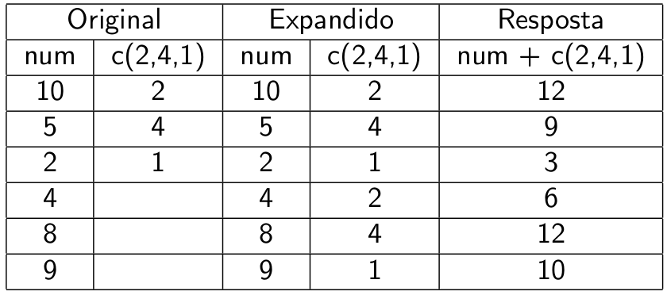

```{r setup, include=FALSE}
source("setup_knitr.R")
```

# Funções e argumentos

As funções no R são definidas como:

```{r eval=FALSE}
nome(argumento1, argumento2, ...)
```

Exemplo: função `runif()` (para gerar valores aleatórios de uma
distribuição uniforme):

```{r eval=FALSE}
runif(n, min = 0, max = 1)
```
```{r }
runif(10, 1, 100)
```

Argumentos que já possuem um valor especificado (como `max` e `min`)
podem ser omitidos:

```{r eval=FALSE}
runif(10)
```

Se os argumentos forem nomeados, a ordem deles dentro da função não tem
mais importância:

```{r eval=FALSE}
runif(min = 1, max = 100, n = 10)
```

Argumentos nomeados e não nomeados podem ser utilizados, desde que os
não nomeados estejam na posição correta:

```{r eval=FALSE}
runif(10, max = 100, min = 1)
```

## Outros tipos de argumentos

Exemplo: função `sample()`:

```{r eval=FALSE}
sample(x, size, replace = FALSE, prob = NULL)
```

- `x` e `size` devem ser obrigatoriamente especificados
- `replace` é lógico: `TRUE` (`T`) ou `FALSE` (`F`)
- `prob` é um argumento vazio ou ausente (“opcional”)

Exemplo: função `plot()`:

```{r eval=FALSE}
plot(x, y, ...)
```

- "`...`" permite especificar argumentos de outras funções (por exemplo
  `par()`)

# Mecanismos de ajuda

Argumentos e detalhes do funcionamento das funções:

```{r eval=FALSE}
?runif
```

ou

```{r eval=FALSE}
help(runif)
```

A documentação contém os campos:

- **Description:** breve descrição
- **Usage:** função e todos seus argumentos
- **Arguments:** lista descrevendo cada argumento
- **Details:** descrição detalhada
- **Value:** o que a função retorna
- **References:** bibliografia relacionada
- **See Also:** funções relacionadas
- **Examples:** exemplos práticos

Procura por funções que contenham `palavra`:

```{r eval=FALSE}
help.search("palavra")
```

Ajuda através do navegador (também contém manuais, ...):

```{r eval=FALSE}
help.start()
```

Busca por `palavra` nos arquivos da lista de discussão do R:

```{r eval=FALSE}
RSiteSearch("palavra")
```

# Criando uma função

A ideia original do R é transformar usuários em programadores

Criar funções para realizar trabalhos específicos é um dos grandes
poderes do R

Por exemplo, podemos criar a famosa função

```{r }
ola.mundo <- function(){
    writeLines("Olá mundo")
}
```

E chama-la através de

```{r }
ola.mundo()
```

A função acima não permite alterar o resultado de saída. Podemos fazer
isso incluindo um **argumento**

```{r }
ola.mundo <- function(texto){
    writeLines(texto)
}
```

E fazer por exemplo

```{r }
ola.mundo("Funções são legais")
```

(Veremos detalhes de funções mais adiante)

# Exercícios

- Usando a função `runif()` gere $30$ números aleatórios entre:
    - 0 e 1
    - -5 e 5
    - 10 e 500
    alternando a posição dos argumentos da função.
- Veja o help da função (?) `"+"`
- Crie uma função para fazer a soma de dois números: `x` e `y`

# Objetos

## Programação orientada a objetos

O que é um objeto?

- Um **símbolo** ou uma **variável** capaz de armazenar qualquer valor
  ou estrutura de dados

Por quê objetos?

- Uma maneira simples de acessar os dados armazenados na memória (o R
  não permite acesso direto à memória)

Programação:

- Objetos &nbsp; &rArr; &nbsp; Classes &nbsp; &rArr; &nbsp; Métodos

> “Tudo no R é um objeto.”
>
> “Todo objeto no R tem uma classe”

- **Classe:** é a definição de um objeto. Descreve a forma do objeto e
  como ele será manipulado pelas diferentes funções
- **Método:** são **funções genéricas** que executam suas tarefas de
  acordo com cada classe. As funções genéricas mais importantes são:
    - `summary()`
    - `plot()`

Veja o resultado de

```{r eval=FALSE}
methods(summary)
methods(plot)
```

A variável `x` recebe o valor $2$ (tornando-se um objeto dentro do R):

```{r }
x <- 2
```

> O símbolo `<-` é chamado de **operador de atribuição**. Ele serve para
> atribuir valores a objetos, e é formado pelos símbolos `<` e `-`,
> obrigatoriamente **sem espaços**.

Para ver o conteúdo do objeto:

```{r }
x
```

> **Observação**: O símbolo `=` pode ser usado no lugar de `<-` mas não
> é recomendado.

Quando você faz

```{r }
x <- 2
```

está fazendo uma **declaração**, ou seja, declarando que a variável `x`
irá agora se tornar um objeto que armazena o número `2`. As declarações
podem ser feitas uma em cada linha

```{r }
x <- 2
y <- 4
```

ou separadas por `;`

```{r }
x <- 2; y <- 4
```

Operações matemáticas em objetos:

```{r }
x + x
```

Objetos podem armazenar diferentes estruturas de dados:

```{r }
y <- runif(10)
y
```

Note que cada objeto só pode armazenar uma estrutura (um número ou uma
sequência de valores) de cada vez! (Aqui, o valor $4$ que estava
armazenado em `y` foi sobrescrito pelos valores acima.)

## Nomes de objetos

- Podem ser formados por letras, números, "`_`", e "`.`"
- Não podem começar com número e/ou ponto
- Não podem conter espaços
- Evite usar acentos
- Evite usar nomes de funções como:

> `c q t C D F I T diff df data var pt`

- O R é *case-sensitive*, portanto:

> `dados` $\neq$ `Dados` $\neq$ `DADOS`

# Gerenciando a área de trabalho

Liste os objetos criados com a função `ls()`:

```{r eval=FALSE}
ls()
```

Para remover apenas um objeto:

```{r eval=FALSE}
rm(x)
```

Para remover outros objetos:

```{r eval=FALSE}
rm(x, y)
```

Para remover todos os objetos:

```{r eval=FALSE}
rm(list = ls())
```

> **Cuidado!** O comando acima apaga todos os objetos na sua área de
> trabalho sem perguntar. Depois só é possível recuperar os objetos ao
> rodar os script novamente.

# Exercícios

1. Armazene o resultado da equação $32 + 16^2 - 25^3$ no objeto `x`
2. Divida `x` por $345$ e armazene em `y`
3. Crie um objeto (com o nome que você quiser) para armazenar $30$
   valores aleatórios de uma distribuição uniforme entre $10$ e $50$
4. Remova o objeto `y`
5. Remova os demais objetos de uma única vez
6. Procure a função utilizada para gerar numeros aleatórios de uma
   distribuição de Poisson, e gere $100$ valores para a VA $X \sim
   \text{Poisson}(5)$.

# Classes de objetos

O R possui 5 classes básicas de objetos, também chamados de objetos
"atômicos":

- `character`
- `numeric`
- `integer`
- `complex`
- `logical`

> Um vetor só pode conter elementos de uma mesma classe

(A única excessão é a lista).

## Vetor

Características:

- Coleção ordenada de valores
- Estrutura unidimensional

Usando a função `c()` para criar vetores:

```{r }
num <- c(10, 5, 2, 4, 8, 9)
num
class(num)
```

Por que `numeric` e não `integer`?

```{r}
x <- c(10L, 5L, 2L, 4L, 8L, 9L)
x
class(x)
```

Para forçar a representação de um número para inteiro é necessário usar
o sufixo `L`.

Note que a diferença entre `numeric` e `integer` também possui impacto
computacional, pois o armazenamento de números inteiros ocupa menos
espaço na memória. Dessa forma, esperamos que o vetor `x` acima ocupe
menos espaço na memória do que o vetor `num`, embora sejam aparentemente
idênticos. Veja:

```{r}
object.size(num)
object.size(x)
```

A diferença pode parecer pequena, mas pode ter um grande impacto
computacional quando os vetores são formados por milhares ou milhões de
números.

## Representação numérica dentro do R

Os números que aparecem na tela do console do R são apenas
representações simplificadas do número real armazenado na memória. Por
exemplo,

```{r, echo = -1}
set.seed(123)
x <- runif(10)
x
```

O objeto `x` contém números como `r x[1]`, `r x[2]`, etc, que possuem 7
casas decimais, que é o padrão do R. O número de casas decimais é
controlado pelo argumento `digits` da função `options`. Para visualizar
essa opção, use

```{r}
getOption("digits")
```

Note que esse valor de 7 é o número de **dígitos significativos**, e
pode variar conforme a sequência de números. Por exemplo,

```{r, echo = -1}
set.seed(12)
y <- runif(10)
y
```

possui valores com 9 casas decimais. Isto é apenas a representação do
número que aparece na tela. Internamente, cada número é armazenado com
uma precisão de 22 casas decimais! Você pode ver o número com toda sua
precisão usando a função `print()` e especificando o número de casas
decimais com o argumento `digits` (de 1 a 22)

```{r}
print(x, digits = 1)
print(x, digits = 7) # padrão
print(x, digits = 22)
```

Também é possível alterar a representação na tela para o formato
científico, usando a função `format()`

```{r, echo = -1}
xf <- format(x, scientific = TRUE)
format(x, scientific = TRUE)
```

Nessa representação, o valor `r xf[1]` = $2.875775 \times 10^{-01}$ =
`r x[1]`.

## Sequências de números

Usando a função `seq()`

```{r }
seq(1, 10)
```

Ou `1:10` gera o mesmo resultado. Para a sequência variar em $2$

```{r }
seq(from = 1, to = 10, by = 2)
```

Para obter $15$ valores entre $1$ e $10$

```{r }
seq(from = 1, to = 10, length.out = 15)
```

Usando a função `rep()`

```{r }
rep(1, 10)
```

Para gerar um sequência várias vezes

```{r }
rep(c(1, 2, 3), 5)
```

Para repetir um número da sequência várias vezes

```{r }
rep(c(1, 2, 3), each = 5)
```

## Operações matemáticas em vetores

Operações podem ser feitas entre um vetor e um número:

```{r }
num * 2
```

E também entre vetores de mesmo comprimento ou com comprimentos
múltiplos:

```{r }
num * num
num + c(2, 4, 1)
```

## A Regra da Reciclagem



Agora tente:

```{r eval=FALSE}
num + c(2, 4, 1, 3)
```

## Exercícios

1.  Crie um objeto com os valores 54, 0, 17, 94, 12.5, 2, 0.9, 15.
1.  Some o objeto acima com os valores 5, 6.

# Atributos de objetos

Os objetos possuem **atributos**, que servem para descrever o formato
do objeto:

- `names`, `dimnames`
- `length`
- `dim`
- `class`

Classe:

```{r }
class(num)
```

Comprimento:
```{r }
length(num)
```

# Outras classes de vetores

Vetores também podem ter outras classes:

- Vetor de caracteres:
```{r }
caracter <- c("brava", "joaquina", "armação")
caracter
```
- Vetor lógico:
```{r }
logico <- caracter == "armação"
logico
```
ou
```{r }
logico <- num > 4
logico
```

No exemplo anterior, a condição `num > 4` é uma **expressão
condicional**, e o símbolo `>` um **operador lógico**.  Os operadores
lógicos utilizados no R são:

| Símbolo | Significado |
|:-------:|:------------|
|   `<`   | menor       |
|   `<=`  | menor igual |
|   `>`   | maior       |
|   `>=`  | maior igual |
|   `==`  | igual       |
|   `!=`  | diferente   |
|   `&`   | e           |
|   `|`   | ou          |


# Fator

Características:

- Coleção de categorias ou **níveis** (*levels*)
- Estrutura unidimensional

Utilizando as funções `factor()` e `c()`:

```{r }
fator <- factor(c("alta","baixa","baixa","media",
                  "alta","media","baixa","media","media"))
fator
class(fator)
```

Caso haja uma hierarquia, os níveis dos fatores podem ser ordenados:

```{r }
fator <- factor(c("alta","baixa","baixa","media",
                  "alta","media","baixa","media","media"),
                levels = c("alta","media","baixa"))
fator
```

# Exercícios

1. Construa um único objeto com as letras: `A`, `B`, e `C`, repetidas
   cada uma 15, 12, e 8 vezes, respectivamente.
2. Mostre na tela, em forma de verdadeiro ou falso, onde estão as letras
   `B` nesse objeto.
3. Veja a página de ajuda da função `sum()` e descubra como fazer para
   contar o número de letras `B` neste vetor (usando `sum()`).
4. Crie um objeto com 100 valores aleatórios de uma distribuição uniforme
   $U(0,1)$. Conte quantas vezes aparecem valores maiores ou iguais a 0,5.

# Misturando classes de objetos

Algumas vezes isso acontece por acidente, mas também pode acontecer de
propósito.

O que acontece aqui?

```{r}
w <- c(5L, "a")
x <- c(1.7, "a")
y <- c(TRUE, 2)
z <- c("a", T)
```

Lembre-se da regra:

> Um vetor só pode conter elementos de uma mesma classe

Quando objetos de diferentes classes são misturados, ocorre a
**coerção**, para que cada elemento possua a mesma classe.

Nos exemplos acima, nós vemos o efeito da **coerção implícita**, quando
o R tenta representar todos os objetos de uma única forma.

Nós podemos forçar um objeto a mudar de classe, através da **coerção
explícita**, realizada pelas funções `as.*`:

```{r}
x <- 0:6
class(x)
as.numeric(x)
as.logical(x)
as.character(x)
as.factor(x)
```

De `?logical`:

     Logical vectors are coerced to integer vectors in contexts where a
     numerical value is required, with ‘TRUE’ being mapped to ‘1L’,
     ‘FALSE’ to ‘0L’ and ‘NA’ to ‘NA_integer_’.

```{r}
(x <- c(FALSE, TRUE))
class(x)
as.numeric(x)
```

Algumas vezes não é possível fazer a coerção, então:

```{r}
x <- c("a", "b", "c")
as.numeric(x)
as.logical(x)
```

# Valores perdidos e especiais

Valores perdidos devem ser definidos como `NA` (*not available*):

```{r }
perd <- c(3, 5, NA, 2)
perd
class(perd)
```

Podemos testar a presença de `NA`s com a função `is.na()`:

```{r }
is.na(perd)
```

Ou:

```{r }
any(is.na(perd))
```

Outros valores especiais são:

- `NaN` (*not a number*) - exemplo: `0/0`
- `-Inf` e `Inf` - exemplo: `1/0`

A função `is.na()` também testa a presença de `NaN`s:

```{r }
perd <- c(-1,0,1)/0
perd
is.na(perd)
```

A função `is.infinite()` testa se há valores infinitos

```{r }
is.infinite(perd)
```

# Matriz

Características:

- Podem conter apenas um tipo de informação (números, caracteres)
- Estrutura bidimensional

Utilizando a função `matrix()`:

```{r }
matriz <- matrix(1:12, nrow = 3, ncol = 4)
matriz
class(matriz)
```

Alterando a ordem de preenchimento da matriz (por linhas):

```{r }
matriz <- matrix(1:12, nrow = 3, ncol = 4, byrow = TRUE)
matriz
```

Para verificar a dimensão da matriz:

```{r }
dim(matriz)
```

Adicionando colunas com `cbind()`

```{r }
cbind(matriz, rep(99, 3))
```

Adicionando linhas com `rbind()`

```{r }
rbind(matriz, rep(99, 4))
```

Matrizes também podem ser criadas a partir de vetores adicionando um
atributo de dimensão

```{r}
m <- 1:10
m
class(m)
dim(m)
dim(m) <- c(2, 5)
m
class(m)
```

## Operações matemáticas em matrizes

Matriz multiplicada por um escalar

```{r }
matriz * 2
```

Multiplicação de matrizes (observe as dimensões!)

```{r }
matriz2 <- matrix(1, nrow = 4, ncol = 3)
matriz %*% matriz2
```

# Lista

Características:

- Pode combinar uma coleção de objetos de diferentes classes (é um tipo
  especial de vetor)
- Estrutura “unidimensional”: apenas o número de elementos é contado

Utilizando a função `list()`:

```{r }
lista <- list(a = 1:10, b = c("T1", "T2", "T3", "T4"), TRUE, 2 + 2)
lista
class(lista)
dim(lista)
length(lista)
```

Formando uma lista com objetos criados anteriormente:

```{r }
lista <- list(fator = fator, matriz = matriz)
lista
length(lista)
```

# Data frame

Características:

- Uma lista de vetores e/ou fatores, de **mesmo comprimento**
- Pode conter diferentes tipos de dados (numérico, fator, ...)
- Estrutura bidimensional

Utilizando a função `data.frame()`:

```{r }
da <- data.frame(ano = 2000:2004,
                 prod = c(32, 54, 25, 48, 29))
da
class(da)
dim(da)
```

Data frames podem ser formados com objetos criados anteriormente, desde
que tenham o mesmo comprimento!

```{r }
length(num)
length(fator)
da <- data.frame(numerico = c(num, NA, NA, NA),
                        fator = fator)
da
class(da)
dim(da)
## Estrutura dos dados
str(da)
```

> A função `str()` é uma das que você precisa decorar!

Para converter um data frame para uma matriz

```{r}
as.matrix(da)
data.matrix(da)
```

Geralmente é o resultado de `data.matrix()` o que você está procurando.

> Note que os níveis de um fator são armazenados internamente como
> números: $1^\circ$ nível = 1, $2^\circ$ nível = 2, $\ldots$

# Nomes (atributo)

Objetos do R podem ter nomes, que facilitam a auto-descrição

```{r}
x <- 1:3
names(x)
names(x) <- c("Curitiba", "Paraná", "Brasil")
x
names(x)
```

Listas também podem ter nomes

```{r}
x <- list(Curitiba = 1, Paraná = 2, Brasil = 3)
x
names(x)
```

Associando nomes às *linhas* e *colunas* de uma matriz:

```{r }
rownames(matriz) <- c("A","B","C")
colnames(matriz) <- c("T1","T2","T3","T4")
matriz
```

Para data frames existe uma função especial para os nomes de linhas,
`row.names()`. Data frames também não possuem nomes de colunas, apenas
nomes, já que é um caso particular de lista. Então para
verificar/alterar nomes de colunas de um data frame também use
`names()`.

```{r}
names(da)
row.names(da)
```

Um resumo das funções para alterar/acessar nomes de linhas e colunas em
matrizes e data frames.


 Classe      | Nomes de colunas | Nomes de linhas
------------ |------------------|---------------
`data.frame` | `names()`        | `row.names()`
`matrix`     | `colnames()`     | `rownames()`


# Exercícios

1.  Crie um objeto para armazenar a seguinte matriz
    $$\left[ \begin{array}{ccc}
            2 & 8 & 4 \\
            0 & 4 & 1 \\
            9 & 7 & 5
			\end{array} \right]$$
1. Atribua nomes para as linhas e colunas dessa matriz.
1. Crie uma lista com dois componentes: (1) um vetor com as letras `A`,
   `B`, e `C`, repetidas 2, 5, e 4 vezes respectivamente; (2) a matriz
   do exemplo anterior.
1. Atribua nomes para estes dois componentes da lista.
1. Inclua mais um componente nesta lista, com o nome de `fator`, e que
   seja um vetor da classe fator, idêntico ao objeto `caracter` criado
   acima (que possui apenas os nomes `brava`, `joaquina`, `armação`).
1. Você contou 42 caranguejos na Joaquina, 34 no Campeche, 59 na
   Armação, e 18 na Praia Mole. Crie um data frame para armazenar estas
   informações (número de caranguejos observados e local).
